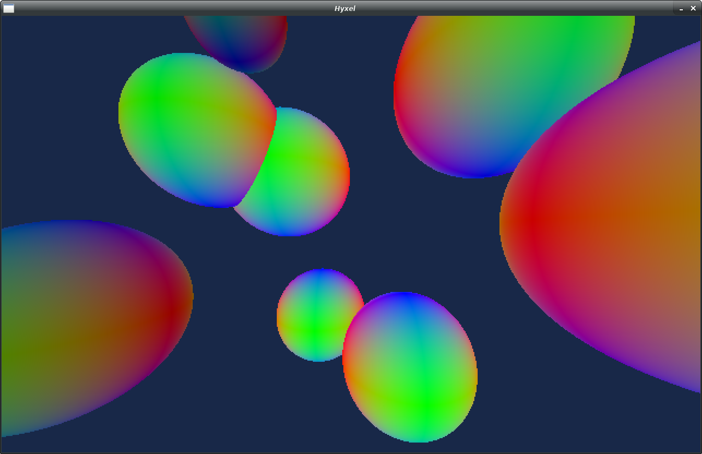

# hyxel

.. was meant to become an experimental ray-traced **4D voxel game**.

"hyxel" is a portmanteau of *hyper* and *voxel*. Technically, one 4D equivalent of *volume* is *content*, but "coxel" has a weird ring to it, and I can't quite figure out why.

Unfortunately, I'm no good at maths, so I gave up trying to understand 4D rotations and translating them into code. That's why this project is currently put on ice. Nonetheless I thought it was interesting to share, so here you go!
